# Problem komiwojażera. Sprawozdanie.

## Założenia i przebieg pracy.
W tym projekcie rozważam problem komiwojażera (obwoźnego sprzedawcy) skupiając się na implementacji poprzez algorytm genetyczny.

W pierwszej kolejności wykonałem autorskie klasy wierzchołka i grafu, które następnie wykorzystane zostały jako reprezentacja grafu nieskierowanego, w którym każda ściezka (krawędź) posiada pewien, stały koszt przejścia.

Następnie dokonałem implementacji algorytmu genetycznego z wykorzystaniem biblioteki *pygad* i zastosowaniem własnej funkcji dopasowania (fitness).

Ostatnim etapem było przeprowadzenie testów wydajności dla trzech różnych grafów o rosnącym poziomie skomplikowania.

## Funkcja dopasowania
### dr. Drakken
    def drakken(the_solution, the_solution_idx):
        predecessor = 0
        check_list = vertices.copy()
        result = 0

        for each in the_solution:
            if each in graph.get_value(predecessor):  # If each is a neighbour
                result -= graph.get_value(predecessor)[each]  # Go

                if each in check_list:  # If it is a first visit => check
                    check_list.remove(each)

                if each == 0:  # If returned to 0
                    if len(check_list) == 0:  # If visited every vertex
                        return result  # OK
                    return -999  # Finished to early

                predecessor = each
            elif each == predecessor:  # If each doesn't move
                continue
            else:
                return -999  # Attempt to jump over path!

        if len(check_list) == 0:
            return result
        return result - 500

Ta funkcaj jest przykładem funkcji *brutalnej*. W przypadku próby wykonania zabronionego ruchu (przejścia do wierzchołka, z którym nie ma połączenia lub powrotu do punktu wyjścia przed odwiedzeniem wszystkich wierzchołków) funkcja zwraca domyślną wartość *błędu* równą `-999`.

Brak przejścia wszystkich wierzchołków pomimo wyczerpania maksymalnego (`len(vertices) * 2`) limitu ruchów nie jest jednak traktowany tak brutalnie. Zwracana jest obliczona wartość z potrąceniem kary punktowej. Jest to spowodowane tym, że w przeciwnym przypadku funkcjonalność funkcji była bliska zeru.

### Dobry glina
    def good_cop(the_solution, the_solution_idx):
        predecessor = 0
        check_list = vertices.copy()
        result = 0

        for each in the_solution:
            if each in graph.get_value(predecessor):  # If each is a neighbour
                result -= graph.get_value(predecessor)[each]  # Go

                if each in check_list:  # If it is a first visit => check
                    check_list.remove(each)

                if each == 0:  # If returned to 0
                    if len(check_list) == 0:  # If visited every vertex
                        return result  # OK
                    result -= 500  # Finished to early

                predecessor = each
            elif each == predecessor:  # If each doesn't move
                continue
            else:
                result -= 100  # Attempt to jump over path!

        if len(check_list) == 0:
            return result
        return result - 500

## Wyniki eksperymentów.

### Mała Su
Czyli mały graf będący instancją własnej klasy Graph o **5** wierzchołkach i **6** krawędziach.

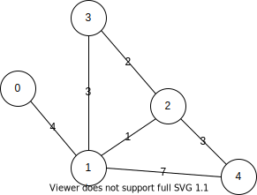

#### Drakońska wersja
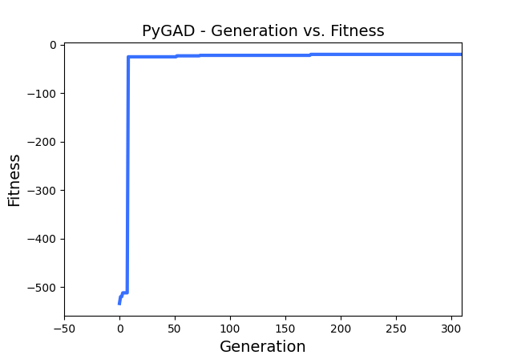

Rozwiązywana jest zazwyczaj w pierwszej **100** generacji.

#### Wersja łaskawsza
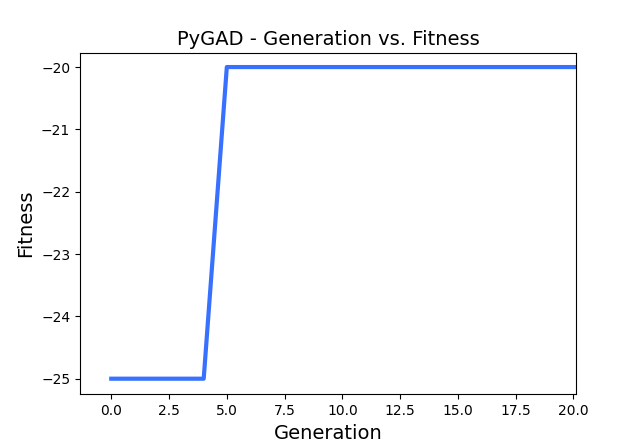

Rozwiązanie ustala się już w **pierwszej** dziesiątce generacji.

### Duży Bob
Graf o **8** wierzchołkach i **14** krawędziach.

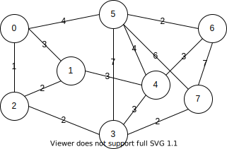

#### Drakońska wersja
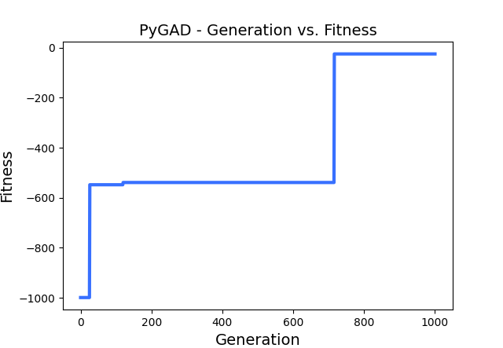
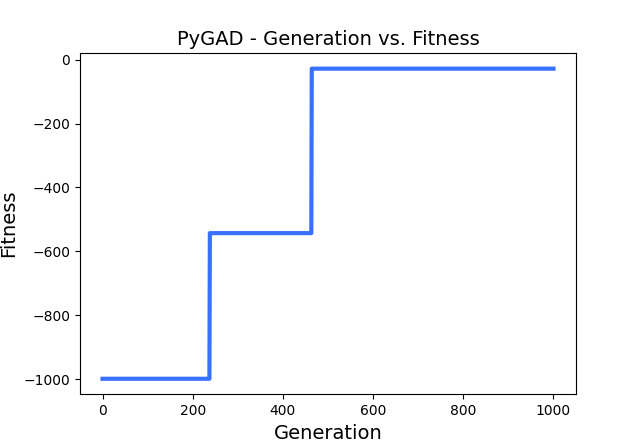
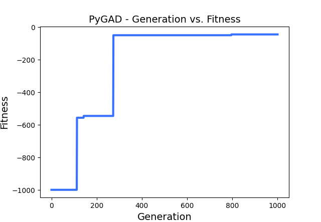
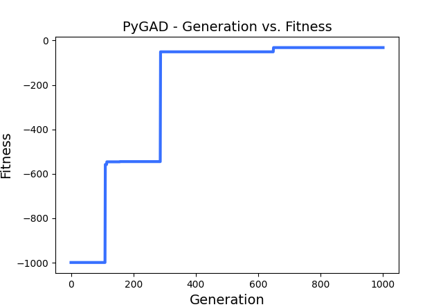

Rozwiązanie klaruje się w przedziale do **1000** pokolenia.

#### Wersja łaskawsza
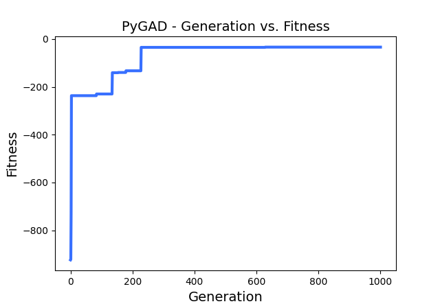
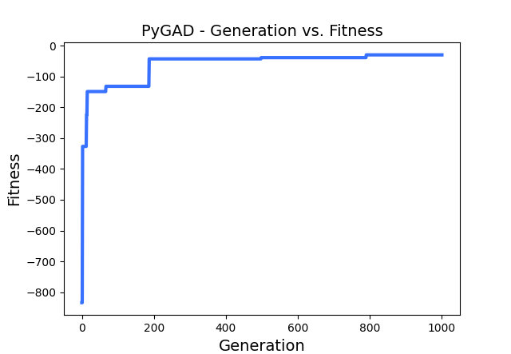

W przeciwieństwie do pierwszej funkcji, w tym przypadku wartość stabilizuje się w okolicach **300** pokolenia.

### Zabójczy Ken
Graf o **12** wierzchołkach i **17** krawędziach.

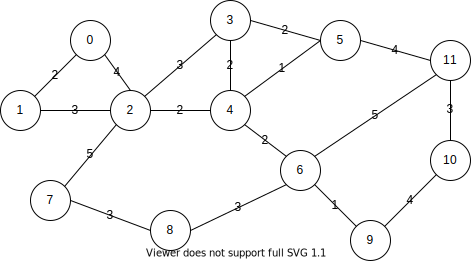

#### Drakońska wersja
Zabójczy Ken przy wykorzystanej tej implementacji okazał się być zbyt trudnym przeciwnikiem.

Nie dało się go rozwiązać w *rozsądnej* jednostce czasu (poniżej pół godziny).

#### Wersja łaskawsza

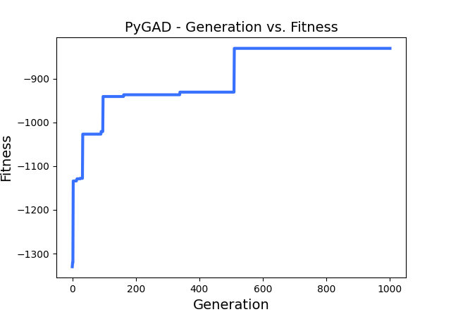
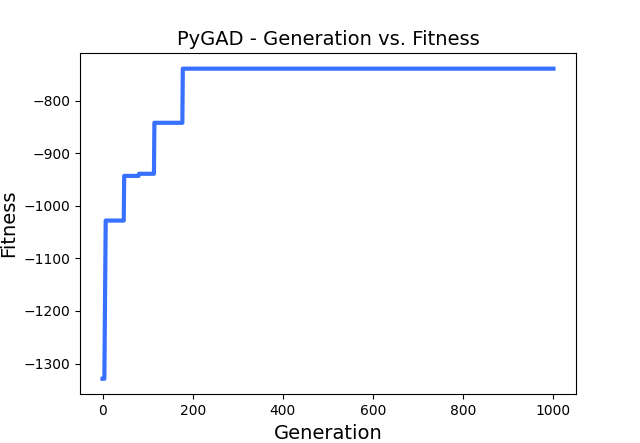

W tym przypadku funkcji udaje się dopasować pewne rozwiązanie, jednak w obu powyższych przypadkach (jak i również każdym, który testowałem) jest ono *zanieczyszczonem*, co widać po wartości, którą zwraca funkcja (**-800**/**-700**).

## Obserwacje.
W miarę jak zwiększał się rozmiar grafu (**ilość wierzchołków**) konieczna była manipuolacja opcjami podawanymi do algorytmu genetycznego.

Domyślne wartości przedstawiane między innymi w dokumentacji szybko zostały zastąpione przez swoje wielokrotności.

Mały graf potrafił znaleźć stosunkowo dobre rozwiązanie (*good enough*) rozwiązanie w standardowych **30** pokoleniach po **10** osobników każde dla wersji brutalnej i nawet do **10** pokolenia dla wersji łagodnej.

Średni graf nie był w stanie znaleźć swojego rozwiązania w domyślnych **30** pokoleniach (za każdym razem zwracana była wartość domyślna *błędu* funkcji *fitness*) dla drakońskiej wersji funkcji *fitness*. Ale również wyniki przy małej liczbie generacji nie były zadowalające dla funkcji *good_cop*.

Największy graf zgodnie z oczekiwaniami sprawił najwięcej problemów. Ze względu na ilość wierzchołków i rygorystyczny charakter funkcji *drakken*, która niepozwalała na wcześniejszy powrót do punktu startowego lub przeskok do wierzchołka, który nie był sąsiadem, algorytm nie był w stanie wyznaczyć **żadnego** rozwiązania nawet dla **10_000** pokoleń, dla których działał około **15** minut.
Jednak wykorzystanie łagodniejszego algorytmu pozwoliło na znaleźienie pewnych rozwiązań.

## Wnioski.
Funkcja *drakken* wydaje się być zbyt rygorystyczna powodując natychmiastowe odrzucenie *chromosomu* posiadającego nawet jeden *błąd*. Prowadziło to do dużej liczby pokoleń i/lub osobników, a zatem i długiego czasu działania.

Zwiększająca się liczba wierzchołków powoduje wydłużenie *chromosomu*, a co za tym idzię zwiększenie prawdopodobieństwa wystpienia *błędu* i przerwania powtórzenia. O wiele lepiej sprawdziła się w tym przypadku funkcja stosując lżejsze metody *karania* niedokońca poprawnych rozwiązań.